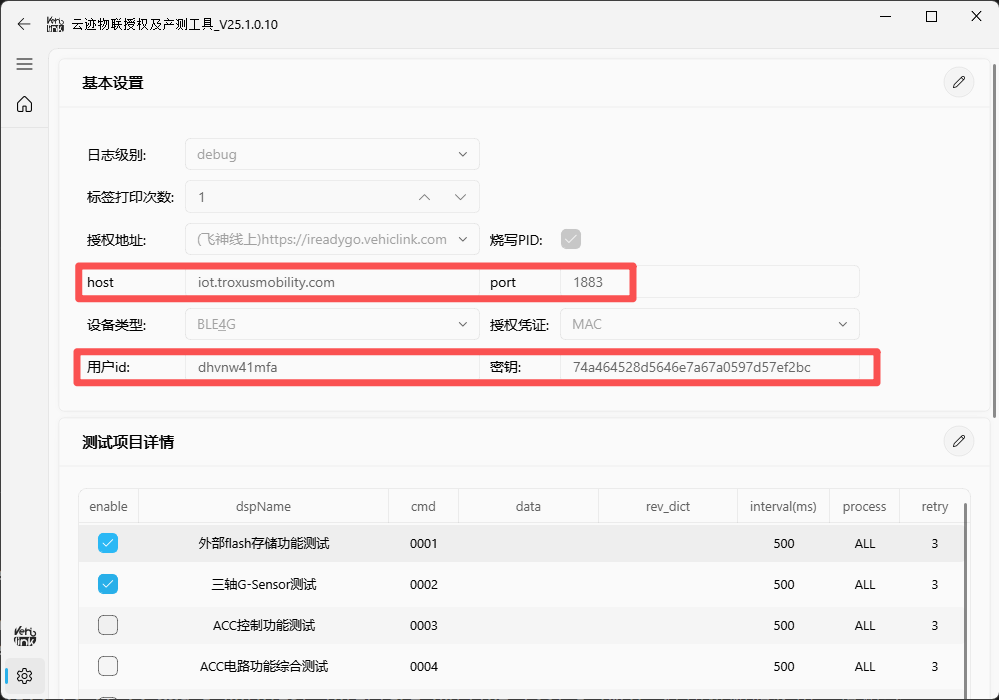

现在想要新增一个固件管理页面，其中会用到data_manage.py里面的变量

@Firmware_interface.py 中新增下载接口

## 固件管理页面布局
垂直布局

### 卡片1
输入框2个 "pid" "硬件版本号"，顶端水平对其
按键1：查询固件信息 

### 卡片2
固件信息显示页面：按json键值对内容展示 
按键2：下载生产固件

## Api
其中查询固件信息和下载固件涉及三个Api接口

1.获取token
POST：
self.regUrl = 云端地址
tokenUrl = self.regUrl + '/api/v1/oauth2/clientToken'
body：
    tokenPara = {"clientId": self.clientId, "clientSecret": self.clientSecret}
Response：
{
    "code": 200,
    "msg": "操作成功",
    "data": {
        "token": "ErILVt5htcCd0vIPxDqGxzv9F5QU1RKZcjCAqUzekTZxb1YLox2DJ1xhykfa",
        "clientId": "dhvnw41mfa",
        "expiresIn": 7199,
        "scope": "null"
    }
}

2.固件信息

HOST：
Url = self.regUrl + '/api/v1/oauth2/clientToken'

POST：

headers：
token: ErILVt5htcCd0vIPxDqGxzv9F5QU1RKZcjCAqUzekTZxb1YLox2DJ1xhykfa
body：
{
  "hardwareVersion": "VBox-TC01-R-1.0",
  "productIotId": "YJ0000aj1d"
}

Response：
{
    "code": 200,
    "msg": "操作成功",
    "data": {
        "version": "1.1.9",
        "host": "mqtt.dev.vehiclink.com",
        "port": "1884",
        "uploadId": "ea2affc9-1166-4ee5-8f11-e4106298a800",
        "filename": "VBOX_YJ0000aj1d_V1.1.9.251117.bin",
        "descriptionCn": "英科iReadyGO测试固件",
        "descriptionEn": null,
        "relyFirmware": null,
        "relyVersion": null,
        "createTime": 1763374719321
    }
}

3.下载固件
GET 云端地址+/api/v1/common/file/download/+uploadId

这里直接弹出弹窗保存内容到本地，文件类型和GET到的文件类型一致

页面可以控件类型需要使用fluentwidget库中的Qt风格控件非原生Qt5控件，可以参考其他interface文件，以及库qfluentwidgets中示例